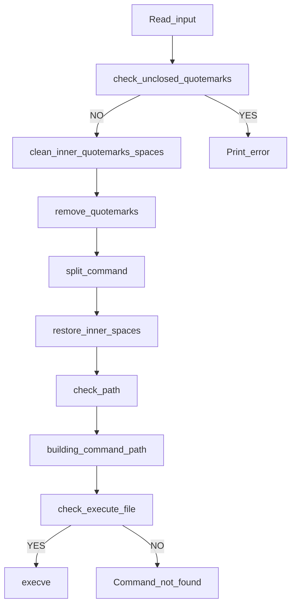

# Minishell

```mermaid
  graph TD;
      Read_input --> check_unclosed_quotemarks;
      check_unclosed_quotemarks --> |NO| clean_inner_quotemarks_spaces; 
      check_unclosed_quotemarks --> |YES| Print_error;
      clean_inner_quotemarks_spaces --> remove_quotemarks;
      remove_quotemarks --> split_command;
      split_command --> restore_inner_spaces;
      restore_inner_spaces --> check_path;
      check_path --> building_command_path;
      building_command_path --> check_execute_file;
      check_execute_file --> |YES| execve;
      check_execute_file --> |NO| Command_not_found;
```
